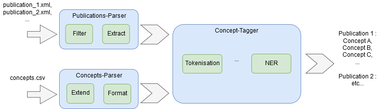

# Concept-Tagger
Core NLP pipeline including NER for statistical concepts.

The projectis structured as follow :
* **concept-parser** : module used to parse RDF Graph of concepts and format for Core NLP NER pipeline.
* **publi-parser** : module used to parse XML publication files ad extract text from it.
* **s3-manager** : little module useful for handling data from S3 DB.

Here is the first idea of the project :

**TODO**: 
* Search files on applishare (http requests) & filter with sql query
* Find how to train a NER with CoreNLP : is the training file a simple
  list of named entities or tagged publication ?
* Update README & figure